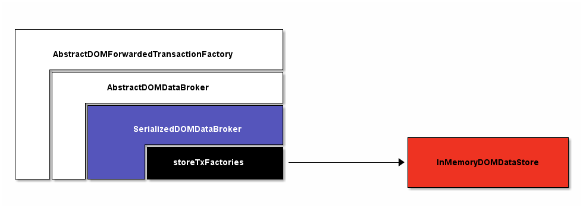
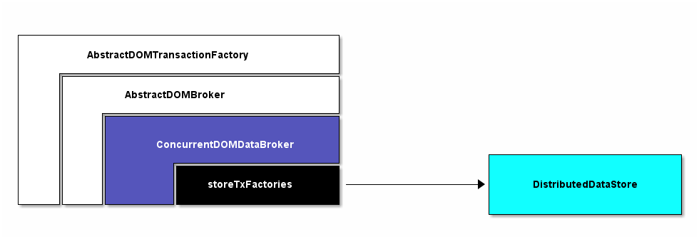

# DistributedDataStore

如果需要将其它数据库通过插件形式集成到ODL中，则需要参考此文档[Wiki MD-SAL](https://wiki.opendaylight.org/view/OpenDaylight_Controller:MD-SAL:Architecture:DOM_DataStore:Plugging_in_a_Datastore_into_MD-SAL)相应的API及其SPI 

## DataStore简介

ODL的DataStore设计为插件方式集成到MDSAL中，用户可以根据需要替换为自己的数据库插件，社区Controller项目的DataStore插件有以下两种实现方式  

+ DistributedDataStore - 集群环境下建议数据库

+ InMemoryDOMDataStore - 单节点环境下建议数据库

无论何种数据库实现，DataStore都需要支持MDSAL定义的接口特性，主要包括如下:

+ 数据库操作均必须由事务来完成，并且实现事务的基本功能特点(ACID)

+ 数据库支持基于YANG定义的树形结构通过Path路径对数据变化进行监听(DataChange)

+ 支持事务链，事务链实际是将多个单独事务封装成一个事务进行处理，主要用于提高性能  

本文主要分析DataStore适配的各个组件之间的关联关系，不会过多涉及DataStore内部具体实现方式，仅作为数据库替换的前期分析工作

## BindingDOMDataBrokerAdapter

业务看到的只是BindingDOMDataBrokerAdapter, 具体的DOMDataBroker实现适配进BindingDOMDataBrokerAdapter

BindingToNormalizedNodeCodec用于BA到BI，即将业务数据NormalizedNode化处理  
DOMDataBroker及其DataTreeChangeService需要适配具体的实现，下面分析DOMDataBroker实现

### SerializedDOMDataBroker

SerializedDOMDataBroker适配到BindingDOMDataBrokerAdapter  
.png)

InMemoryDOMDataStore适配到SerializedDOMDataBroker

创建写事务 dataBroker.newWriteOnlyTransaction()
.png)

创建读事务 dataBroker.newReadOnlyTransaction()
.png)

### ConcurrentDOMDataBroker

ConcurrentDOMDataBroker适配到BindingDOMDataBrokerAdapter  
.png)

DistributedDataStore适配到ConcurrentDOMDataBroker

创建写事务 dataBroker.newWriteOnlyTransaction(), 注意这里的写事务并没有到DistributedDataStore中创建真正的写事务
.png)

创建读事务 dataBroker.newReadOnlyTransaction(), 注意这里的读事务并没有到DistributedDataStore中创建真正的读事务
.png)

WRITE操作，实际执行Write操作的时候才会在DistributedDataStore中创建真正的写事务, 写事务通过限速进行限制
.png)

READ操作，实际执行Read操作的时候才会在DistributedDataStore中创建真正的读事务
.png)

## InMemoryDOMDataStore

## DistributedDataStore
