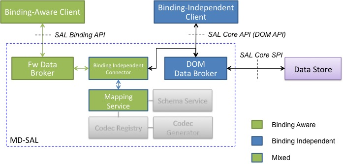

# DistributedDataStore

如果需要将其它数据库通过插件形式集成到ODL中，则需要参考此文档[Wiki MD-SAL](https://wiki.opendaylight.org/view/OpenDaylight_Controller:MD-SAL:Architecture:DOM_DataStore:Plugging_in_a_Datastore_into_MD-SAL)相应的API及其SPI 

## DataStore简介

ODL的DataStore设计为插件方式集成到MDSAL中，用户可以根据需要替换为自己的数据库插件，社区Controller项目的DataStore插件有以下两种实现方式  

+ DistributedDataStore - 集群环境下建议荐数据库

+ InMemoryDOMDataStore - 单节点环境下建议数据库

无论何种数据库实现，DataStore都需要支持MDSAL定义的接口特性，主要包括如下:

+ 数据库操作均必须由事务来完成，并且实现事务的基本功能特点(ACID)

+ 数据库支持基于YANG定义的树形结构通过Path路径对数据变化进行监听(DataChange)

+ 支持事务链，事务链实际是将多个单独事务封装成一个事务进行处理，主要用于提高性能

## BindingDOMDataBrokerAdapter

## InMemoryDOMDataStore

## DistributedDataStore
